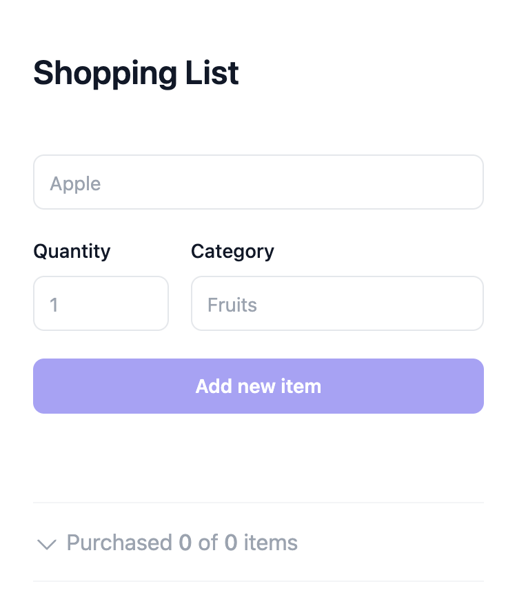
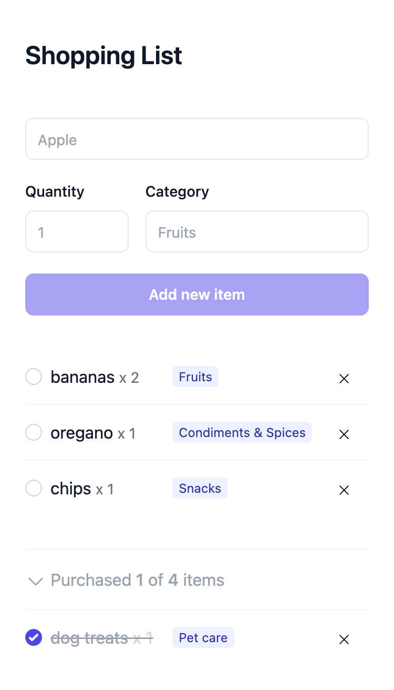
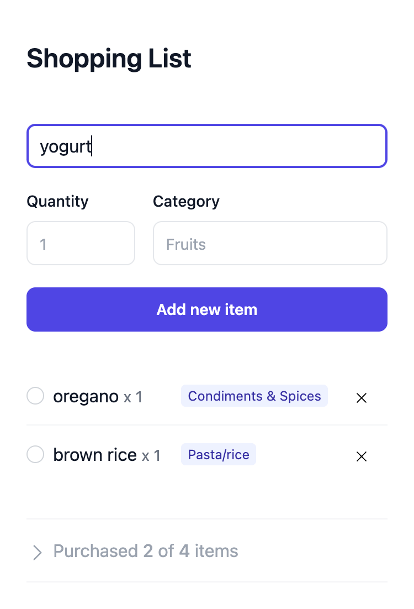

# Shopping List

## Features

- Add items to the shopping list
    - Having preset common categories, and user can add their own categories
    - The "Add new item" button will be disabled if the input is empty.
- Delete items from the shopping list
- Mark items as purchased 
    - The items will be moved to the purchased list.
- The shopping list will be saved to local storage
    - It will be loaded when the page is refreshed.
- Responsive design
